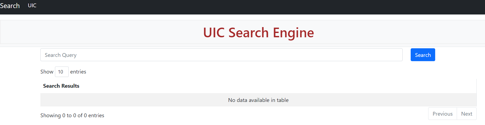
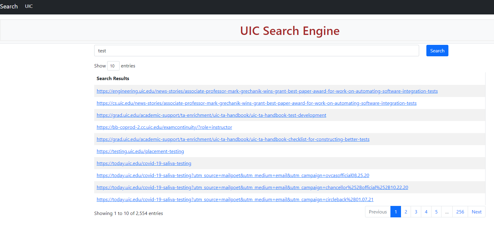

# IR-System-Search-Engine

## Requirements

- Python3
- Python libraries
    - nltk
    - networkx
    - scrapy
    - beautiful soup
    - flask

## How To Run
- Make the following changes in search.py [website](website/) module.
    - Set the number of pages to crawl in the `crawl_limit` variable.
    - Set the root folder name where the documents will be stored in the variable `root_folder`.
- Run the search.py script in [website](website/) module.
- This runs a flask application and opens the application in localhost on a port (usually 5000, this can be configured).
- Click the link which will open the landing page.

- Enter the query in the Search Box and click `Search`
- The query results appear like this.

## Report

Click [Here](docs/) for the report.
